# TPLearn System Context Flow Diagram

## Overview
This document presents the **Context Flow Diagram** (Level 0 Data Flow Diagram) for the TPLearn Academic Learning Management System. It shows the system's boundaries, external entities, and the high-level data flows between them.

---

## Context Flow Diagram (Level 0 DFD)

```mermaid
flowchart TB
    %% External Entities
    Admin[👑 System Administrator]
    Tutor[👩‍🏫 Tutor]
    Student[🎓 Student]
    Parent[👨‍👩‍👧‍👦 Parent/Guardian]
    PaymentGateway[💳 Payment Gateway<br/>GCash/Bank]
    VideoService[📹 Video Conference Service<br/>Jitsi Meet]
    FileSystem[📁 File Storage System]
    EmailService[📧 Email Service]
    
    %% Central System Process
    TPLearnSystem((🏫 TPLearn<br/>Learning Management<br/>System<br/>Process 0))
    
    %% Data Flows from External Entities to System
    Admin -->|"User Management Requests<br/>System Configuration<br/>Report Requests"| TPLearnSystem
    Tutor -->|"Registration Data<br/>Program Materials<br/>Assessment Data<br/>Attendance Records<br/>Grades & Feedback"| TPLearnSystem
    Student -->|"Registration Data<br/>Enrollment Requests<br/>Assignment Submissions<br/>Assessment Responses<br/>Payment Information"| TPLearnSystem
    Parent -->|"Student Registration Data<br/>Contact Information<br/>Payment Authorization"| TPLearnSystem
    PaymentGateway -->|"Payment Confirmations<br/>Transaction Status<br/>Receipt Data"| TPLearnSystem
    VideoService -->|"Session Status<br/>Recording Data<br/>Participant Info"| TPLearnSystem
    FileSystem -->|"File Metadata<br/>Storage Confirmations"| TPLearnSystem
    EmailService -->|"Email Delivery Status<br/>Bounce Reports"| TPLearnSystem
    
    %% Data Flows from System to External Entities
    TPLearnSystem -->|"User Account Status<br/>System Reports<br/>Analytics Data<br/>Backup Requests"| Admin
    TPLearnSystem -->|"Program Assignments<br/>Student Lists<br/>Performance Reports<br/>Session Schedules<br/>Submission Notifications"| Tutor
    TPLearnSystem -->|"Program Information<br/>Learning Materials<br/>Grades & Feedback<br/>Schedule Updates<br/>Notifications"| Student
    TPLearnSystem -->|"Progress Reports<br/>Payment Reminders<br/>Academic Updates<br/>Attendance Notifications"| Parent
    TPLearnSystem -->|"Payment Requests<br/>Transaction Details"| PaymentGateway
    TPLearnSystem -->|"Session Creation Requests<br/>Meeting Invitations<br/>Recording Requests"| VideoService
    TPLearnSystem -->|"File Upload Requests<br/>Storage Requirements<br/>Deletion Requests"| FileSystem
    TPLearnSystem -->|"Email Notifications<br/>Password Reset Links<br/>System Announcements"| EmailService
    
    %% Styling
    classDef entityStyle fill:#e3f2fd,stroke:#1976d2,stroke-width:2px,color:#000
    classDef systemStyle fill:#fff3e0,stroke:#f57c00,stroke-width:4px,color:#000
    classDef flowStyle stroke:#666,stroke-width:1px
    
    class Admin,Tutor,Student,Parent,PaymentGateway,VideoService,FileSystem,EmailService entityStyle
    class TPLearnSystem systemStyle
```

---

## External Entities Description

### 🧑‍💼 **Primary Users**

| Entity | Description | Role |
|--------|-------------|------|
| **👑 System Administrator** | IT personnel responsible for system management | - Manages user accounts and system settings - Monitors system performance - Handles technical configurations - Generates administrative reports |
| **👩‍🏫 Tutor** | Educational professionals delivering instruction | - Creates and manages academic content - Conducts live sessions - Evaluates student performance - Tracks attendance and progress |
| **📠Student** | Primary learners using the platform | - Enrolls in programs - Accesses learning materials - Submits assignments and assessments - Participates in live sessions |
| **👨‍👩‍👧‍👦 Parent/Guardian** | Student supporters and decision makers | - Provides registration authorization - Receives progress updates - Handles payment responsibilities - Monitors academic performance |

### 🔗 **External Systems**

| Entity | Description | Integration Purpose |
|--------|-------------|---------------------|
| **💳 Payment Gateway** | Financial transaction processing systems (GCash, Banks) | - Processes enrollment fees - Validates payment receipts - Handles refunds and transactions |
| **📹 Video Conference Service** | Jitsi Meet video conferencing platform | - Enables live teaching sessions - Provides interactive whiteboard - Records sessions for playback |
| **📠File Storage System** | Local/cloud file storage infrastructure | - Stores learning materials - Manages assignment submissions - Handles multimedia content |
| **📧 Email Service** | SMTP email delivery system | - Sends notifications and alerts - Delivers password reset links - Distributes system announcements |

---

## Data Flow Categories

### 📥 **Inbound Data Flows**

#### **From Primary Users:**
- **Authentication Data**: Login credentials, session tokens
- **Profile Information**: Personal details, academic records, contact information
- **Academic Content**: Course materials, assignments, assessments, grades
- **Participation Data**: Attendance records, session interactions, submissions
- **Financial Data**: Payment information, receipts, transaction requests

#### **From External Systems:**
- **Payment Confirmations**: Transaction status, receipt validation, financial records
- **Video Session Data**: Meeting status, participant lists, recording metadata
- **File System Responses**: Storage confirmations, metadata, access permissions
- **Email Delivery Reports**: Send status, bounce notifications, delivery confirmations

### 📤 **Outbound Data Flows**

#### **To Primary Users:**
- **Educational Content**: Learning materials, course information, schedules
- **Performance Data**: Grades, feedback, progress reports, analytics
- **Communication**: Notifications, announcements, reminders, alerts
- **Administrative Information**: Account status, enrollment confirmations, system updates

#### **To External Systems:**
- **Payment Requests**: Transaction initiation, amount details, recipient information
- **Video Session Commands**: Meeting creation, invitations, recording requests
- **File Operations**: Upload requests, download permissions, storage management
- **Email Instructions**: Message content, recipient lists, delivery preferences

---

## System Boundaries & Scope

### ✅ **Within System Scope:**
- User authentication and authorization
- Program and enrollment management
- Content creation and distribution
- Assessment and grading workflows
- Live session coordination
- Payment processing coordination
- Communication and notification management
- Academic progress tracking
- Administrative reporting and analytics

### ❌ **Outside System Scope:**
- Actual payment processing (handled by payment gateways)
- Video streaming infrastructure (handled by Jitsi Meet)
- Physical file storage (handled by file system)
- Email delivery infrastructure (handled by email service)
- Internet connectivity and network infrastructure
- Device hardware and operating systems
- Web browser functionality

---

## Data Flow Principles

### 🔄 **Bidirectional Flows:**
Most interactions between external entities and the TPLearn system are bidirectional, involving:
- **Request-Response Patterns**: Users request services, system provides responses
- **Data Exchange**: Continuous information sharing for real-time updates
- **Status Updates**: System informs entities of changes and progress

### 📊 **Data Processing Characteristics:**
- **Real-time Processing**: Live sessions, notifications, instant messaging
- **Batch Processing**: Reports generation, bulk data operations
- **Event-driven Processing**: Payment confirmations, submission notifications
- **Scheduled Processing**: Automated reminders, progress reports

### 🔒 **Security & Privacy:**
- **Data Encryption**: All sensitive data flows are encrypted
- **Access Control**: Role-based permissions for data access
- **Audit Trails**: All data flows are logged for security monitoring
- **Privacy Protection**: Personal information is handled according to privacy policies

---

## Integration Points

### 🔌 **API Integrations:**
- **Payment Gateway APIs**: For transaction processing and validation
- **Video Service APIs**: For session management and recording
- **Email Service APIs**: For notification delivery
- **File Storage APIs**: For content management

### 🌐 **Communication Protocols:**
- **HTTPS/REST**: For web-based API communications
- **WebRTC**: For real-time video communications
- **SMTP**: For email delivery
- **FTP/SFTP**: For file transfers

### 🔄 **Data Synchronization:**
- **Real-time Sync**: Live session data, instant notifications
- **Periodic Sync**: Payment status updates, email delivery reports
- **Event-based Sync**: Triggered by user actions or system events

This context flow diagram provides a high-level view of how TPLearn interacts with its environment, showing the system as a single process that transforms inputs from external entities into meaningful outputs, while maintaining clear boundaries between what the system controls and what external services provide.