# TPLearn System Use Case Diagram

## System Overview
**TPLearn** is an Academic Learning Management System designed for online tutoring and educational programs. The platform supports three main user roles: Admin, Tutor, and Student, with comprehensive features for program management, live sessions, assessments, and academic tracking.

---

## Use Case Diagram

```mermaid
graph TB
    %% Actors
    A[👑 Admin]
    T[👩‍🏫 Tutor]
    S[🎓 Student]
    
    %% System Boundary
    subgraph TPLearn_System["🏫 TPLearn Academic Learning Management System"]
        
        %% Authentication & User Management
        subgraph Auth["🔐 Authentication & User Management"]
            UC1[Login/Logout]
            UC2[Register Student]
            UC3[Register Tutor]
            UC4[Manage User Accounts]
            UC5[Reset Password]
        end
        
        %% Program Management
        subgraph Programs["📚 Program Management"]
            UC6[Create Programs]
            UC7[Manage Programs]
            UC8[View Programs]
            UC9[Enroll in Programs]
            UC10[Assign Tutors]
        end
        
        %% Content & Materials
        subgraph Content["📝 Content & Materials Management"]
            UC11[Upload Materials]
            UC12[Create Assignments]
            UC13[Create Assessments]
            UC14[View Materials]
            UC15[Download Materials]
            UC16[Submit Assignments]
            UC17[Submit Assessments]
        end
        
        %% Live Sessions & Video Conferencing
        subgraph LiveSessions["🎥 Live Sessions & Video Conferencing"]
            UC18[Create Live Sessions]
            UC19[Join Live Sessions]
            UC20[Manage Video Conference]
            UC21[Use Interactive Whiteboard]
            UC22[Record Sessions]
        end
        
        %% Assessment & Grading
        subgraph Grading["📊 Assessment & Grading"]
            UC23[Grade Submissions]
            UC24[View Grades]
            UC25[Provide Feedback]
            UC26[Track Assessment Attempts]
            UC27[View Assessment Results]
        end
        
        %% Attendance Management
        subgraph Attendance["📅 Attendance Management"]
            UC28[Mark Attendance]
            UC29[View Attendance Records]
            UC30[Generate Attendance Reports]
        end
        
        %% Payment & Enrollment
        subgraph Payment["💰 Payment & Financial Management"]
            UC31[Process Payments]
            UC32[Validate Payment Proofs]
            UC33[Upload Payment Receipts]
            UC34[View Payment History]
            UC35[Generate Payment Reports]
        end
        
        %% Communication & Notifications
        subgraph Communication["📢 Communication & Notifications"]
            UC36[Send Notifications]
            UC37[View Messages]
            UC38[Send Messages]
            UC39[View System Notifications]
        end
        
        %% Reports & Analytics
        subgraph Reports["📈 Reports & Analytics"]
            UC40[Generate System Reports]
            UC41[View Dashboard Statistics]
            UC42[Track Student Progress]
            UC43[View Academic Performance]
            UC44[Export Data]
        end
        
        %% Profile Management
        subgraph Profile["👤 Profile Management"]
            UC45[Manage Profile]
            UC46[Update Personal Information]
            UC47[View Profile]
        end
    end
    
    %% Admin Use Cases
    A --> UC1
    A --> UC4
    A --> UC6
    A --> UC7
    A --> UC10
    A --> UC32
    A --> UC36
    A --> UC40
    A --> UC41
    A --> UC44
    A --> UC45
    
    %% Tutor Use Cases
    T --> UC1
    T --> UC3
    T --> UC8
    T --> UC11
    T --> UC12
    T --> UC13
    T --> UC14
    T --> UC18
    T --> UC19
    T --> UC20
    T --> UC21
    T --> UC22
    T --> UC23
    T --> UC25
    T --> UC28
    T --> UC29
    T --> UC30
    T --> UC37
    T --> UC38
    T --> UC42
    T --> UC43
    T --> UC45
    T --> UC46
    T --> UC47
    
    %% Student Use Cases
    S --> UC1
    S --> UC2
    S --> UC5
    S --> UC8
    S --> UC9
    S --> UC14
    S --> UC15
    S --> UC16
    S --> UC17
    S --> UC19
    S --> UC24
    S --> UC26
    S --> UC27
    S --> UC29
    S --> UC33
    S --> UC34
    S --> UC37
    S --> UC38
    S --> UC39
    S --> UC43
    S --> UC45
    S --> UC46
    S --> UC47

    %% Styling
    classDef actorStyle fill:#e1f5fe,stroke:#01579b,stroke-width:3px,color:#000
    classDef systemStyle fill:#f3e5f5,stroke:#4a148c,stroke-width:2px
    classDef useCaseStyle fill:#e8f5e8,stroke:#2e7d32,stroke-width:1px
    
    class A,T,S actorStyle
    class TPLearn_System systemStyle
```

---

## Detailed Use Case Descriptions

### 👑 **Admin Actor**
**Primary Role:** System administration and oversight

| Use Case | Description |
|----------|-------------|
| **UC1: Login/Logout** | Authenticate and manage admin session |
| **UC4: Manage User Accounts** | Create, update, delete, and manage all user accounts |
| **UC6: Create Programs** | Define new academic programs with details and requirements |
| **UC7: Manage Programs** | Edit, activate/deactivate programs and assign tutors |
| **UC10: Assign Tutors** | Assign qualified tutors to specific programs |
| **UC32: Validate Payment Proofs** | Review and approve payment receipts and transactions |
| **UC36: Send Notifications** | Broadcast system-wide announcements and messages |
| **UC40: Generate System Reports** | Create comprehensive reports on system usage and performance |
| **UC41: View Dashboard Statistics** | Monitor key metrics like enrollments, revenue, and user activity |
| **UC44: Export Data** | Export system data for external analysis |
| **UC45: Manage Profile** | Update admin profile and system settings |

---

### 👩‍🏫 **Tutor Actor**
**Primary Role:** Content delivery and student instruction

| Use Case | Description |
|----------|-------------|
| **UC1: Login/Logout** | Authenticate and manage tutor session |
| **UC3: Register Tutor** | Self-registration with qualifications and specializations |
| **UC8: View Programs** | Browse assigned and available programs |
| **UC11: Upload Materials** | Upload documents, videos, and learning resources |
| **UC12: Create Assignments** | Design assignments with due dates and scoring rubrics |
| **UC13: Create Assessments** | Create quizzes, tests, and evaluations for students |
| **UC18: Create Live Sessions** | Schedule and set up video conference sessions |
| **UC19: Join Live Sessions** | Conduct live teaching sessions with students |
| **UC20: Manage Video Conference** | Control video settings, participants, and session flow |
| **UC21: Use Interactive Whiteboard** | Utilize digital whiteboard for real-time collaboration |
| **UC22: Record Sessions** | Record live sessions for later review |
| **UC23: Grade Submissions** | Evaluate and score student assignments and assessments |
| **UC25: Provide Feedback** | Give detailed feedback on student work |
| **UC28: Mark Attendance** | Record student attendance for sessions |
| **UC29: View Attendance Records** | Monitor student attendance patterns |
| **UC30: Generate Attendance Reports** | Create attendance summaries and reports |
| **UC42: Track Student Progress** | Monitor individual student advancement |
| **UC43: View Academic Performance** | Analyze student grades and performance metrics |

---

### 🎓 **Student Actor**
**Primary Role:** Learning and academic participation

| Use Case | Description |
|----------|-------------|
| **UC1: Login/Logout** | Authenticate and manage student session |
| **UC2: Register Student** | Self-registration with personal and guardian information |
| **UC5: Reset Password** | Recover account access through password reset |
| **UC8: View Programs** | Browse available programs and course offerings |
| **UC9: Enroll in Programs** | Register for academic programs |
| **UC14: View Materials** | Access uploaded learning materials and resources |
| **UC15: Download Materials** | Download documents and files for offline study |
| **UC16: Submit Assignments** | Upload completed assignments within deadlines |
| **UC17: Submit Assessments** | Complete and submit quizzes and tests |
| **UC19: Join Live Sessions** | Participate in live video sessions with tutors |
| **UC24: View Grades** | Check scores and evaluation results |
| **UC26: Track Assessment Attempts** | Monitor assessment submission history |
| **UC27: View Assessment Results** | Review detailed assessment feedback and scores |
| **UC29: View Attendance Records** | Check personal attendance history |
| **UC33: Upload Payment Receipts** | Submit proof of payment for program fees |
| **UC34: View Payment History** | Track payment records and financial transactions |
| **UC37: View Messages** | Read notifications and communications |
| **UC38: Send Messages** | Communicate with tutors and administration |
| **UC39: View System Notifications** | Receive system announcements and updates |
| **UC43: View Academic Performance** | Monitor personal progress and achievements |

---

## System Features Summary

### 🔧 **Core Functionalities**
1. **Multi-role Authentication**: Secure login system for Admin, Tutor, and Student roles
2. **Program Management**: Complete lifecycle management of academic programs
3. **Live Video Sessions**: Integrated video conferencing with interactive whiteboard
4. **Assessment System**: Comprehensive assignment and test submission workflow
5. **Attendance Tracking**: Detailed attendance management and reporting
6. **Payment Processing**: Financial transaction handling with proof validation
7. **Content Management**: File upload, storage, and distribution system
8. **Communication**: Messaging and notification system
9. **Analytics & Reporting**: Performance tracking and data export capabilities

### 📊 **Key System Components**
- **Database**: MySQL with comprehensive user, program, enrollment, and assessment tables
- **File Management**: Secure file upload and storage system
- **Session Management**: Live video conferencing integration
- **API Layer**: RESTful APIs for frontend-backend communication
- **Dashboard Interface**: Role-based dashboards for each user type

### 🎯 **Business Value**
TPLearn provides a complete digital learning ecosystem that enables:
- **Scalable Education Delivery**: Support for multiple programs and unlimited students
- **Interactive Learning**: Real-time video sessions with collaborative tools
- **Academic Tracking**: Comprehensive progress monitoring and assessment
- **Administrative Efficiency**: Automated enrollment, payment, and reporting processes
- **Quality Assurance**: Built-in feedback and grading mechanisms

This use case diagram represents a fully functional Learning Management System designed to support modern online education requirements with robust user management, content delivery, and academic tracking capabilities.